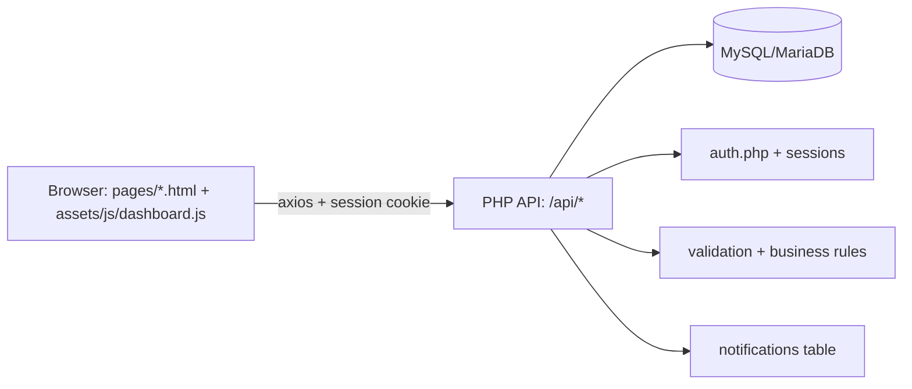

# Capstone / Research 1 — 40% System Development Completion Checklist

Source: `Capstone_40_Percent_System_Completion_Checklist.pdf` (copied into this repo).

> Goal: at least **32 / 40** points.

## A. User Management Module (5 points)

- [x] (1) Login authentication is fully functional (1)
  - Demo: login via `index.html` → dashboard redirects based on role.
  - Backend: `api/auth/login.php`, `api/auth/me.php`, `api/auth/logout.php`

- [x] (2) Role-based access control is implemented (1)
  - Backend: `api/utils/auth.php` (`auth_enforce_roles()`)

- [x] (3) Password hashing/encryption is applied (1)
  - Backend: `api/auth/login.php` uses `password_verify()`

- [x] (4) Session management is working properly (1)
  - Backend: session cookie `path: '/'` to avoid folder-name breaks.

- [x] (5) Unauthorized access is properly restricted (1)
  - Demo: call any `/api/*` endpoint while logged out → `401 Not authenticated`.

Subtotal target: **5 / 5**

## B. Core Functional Module (20 points)

Pick one “core transaction” to present end-to-end. Recommended for demo:

### Option 1: Enrollments (recommended for CRUD demo)

- Demo UI: `pages/enrollments.html`
- Backend: `api/enrollments/enrollments.php`

Expected coverage:
- [ ] (6) Complete end-to-end transaction is operational (5)
- [ ] (7) Input → Processing → Storage → Output verified (5)
- [ ] (8) Business rules are properly enforced (3)
- [ ] (9) CRUD operations functional for core module (3)
- [ ] (10) No dummy buttons or placeholder features (2)
- [ ] (11) System demonstrates real problem-solving logic (2)

### Option 2: Class Offerings (wizard flow)

- Demo UI: `pages/class-offerings.html`
- Frontend: `js/masterfiles/class-offerings.js`
- Backend: `api/class_offerings/class_offerings.php`

Notes:
- Wizard enforces rules:
  - Section school year must match selected school year
  - Duplicate offerings prevented (pre-check + DB unique constraint + PDO 23000 catch)
  - Output verification: Summary step shows teacher-filtered results from backend `getAllClassOfferings`

Expected coverage:
- [ ] (6) Complete end-to-end transaction is operational (5)
- [x] (7) Input → Processing → Storage → Output verified (5)
- [x] (8) Business rules are properly enforced (3)
- [ ] (9) CRUD operations functional for core module (3)
- [x] (10) No dummy buttons or placeholder features (2)
- [x] (11) System demonstrates real problem-solving logic (2)

## C. Database Implementation (10 points)

- [x] (12) Minimum 3–5 normalized database tables (2)
  - System has many normalized tables (see `api/database/dep_ed-2.sql`).

- [x] (13) Primary and foreign keys properly implemented (2)
  - Example: `class_offerings` has PK `class_id` and FKs to `subjects`, `sections`, `employees`, `school_years`.

- [x] (14) Referential integrity enforced (2)
  - MySQL InnoDB FKs present in schema.

- [x] (15) Backend data validation working (2)
  - Examples: required-field checks + school-year consistency checks.

- [ ] (16) Database relationships explained during demo (2)
  - Presenter task (prepare verbal explanation + show ERD/schema screenshot).

Subtotal target: **8 / 10** (item 16 is presentation)

## D. Basic System Architecture & Interface (5 points)

- [x] (17) Final ERD consistent with implementation (1)
  - Schema baseline: `api/database/dep_ed-2.sql`

- [ ] (18) System architecture diagram presented (1)
  - Suggestion: use this Mermaid diagram during demo:

- [x] (19) Working navigation between modules (1)
  - Sidebar navigation across Transactions/Masterfiles.

- [x] (20) Functional forms implemented (not static UI only) (1)
  - Example: Enrollments / Announcements / Class Offerings wizard.

- [x] (21) Basic error handling implemented (1)
  - Backend: returns JSON error messages + HTTP codes.
  - Frontend: toast notifications via `showNotification()`.

Subtotal target: **4 / 5** (item 18 is presentation)

## Quick scoring guide

If you demo **Enrollments** (CRUD + end-to-end) and it’s solid, you should comfortably reach **32+**.

Next steps:
1) Confirm which core module you will present (Enrollments vs Class Offerings).
2) I can harden that module to ensure checklist items (6–11) are clearly satisfied.
